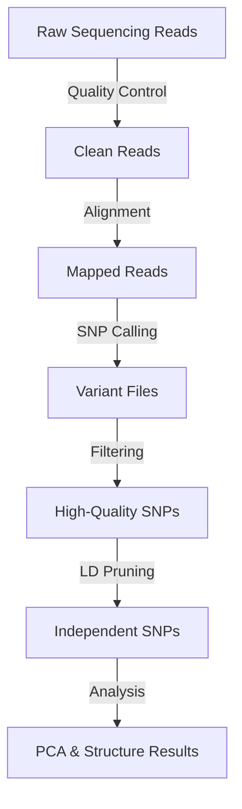

# Population Genomics Analysis Pipeline
## SNP Analysis

[]()
[]()
[]()

---

## 📋 Table of Contents
- [Overview](#overview)
- [What This Project Does](#what-this-project-does)
- [Study Design](#study-design)
- [Pipeline Overview](#pipeline-overview)
- [Detailed Methods](#detailed-methods)
- [Results](#results)
- [Software Used](#software-used)
- [Project Structure](#project-structure)

---

## 🔬 Overview

This project analyzes genetic variation across 18 *Callicarpa* plant samples using whole-genome sequencing (WGS) data. The goal is to understand the population structure and genetic relationships between samples by identifying and analyzing Single Nucleotide Polymorphisms (SNPs) - tiny differences in DNA sequences between individuals.

**Think of it like this:** Each individual plant has a unique "genetic fingerprint" made up of millions of DNA letters. Sometimes these letters differ between individuals (these are SNPs). By comparing these differences across many plants, we can determine which plants are more closely related and how the population is structured.

---

## 🎯 What This Project Does

### Main Goals:
1. **Quality Control**: Ensure sequencing data is high-quality and reliable
2. **SNP Discovery**: Find genetic differences between samples
3. **Population Structure Analysis**: Group samples based on genetic similarity
4. **Principal Component Analysis (PCA)**: Visualize genetic relationships in 2D/3D space

### Why It Matters:
- Understand genetic diversity within *Callicarpa* populations
- Identify distinct genetic groups or populations
- Detect signs of population history (migration, bottlenecks, selection)
- Inform conservation and breeding strategies

---

## 📊 Study Design

### Samples
- **Number of samples**: 18 *Callicarpa* individuals (samples 547-564)
- **Sequencing technology**: Illumina whole-genome sequencing (WGS)
- **Read type**: Paired-end reads (R1 and R2)
- **Reference genome**: *Callicarpa* genome assembly (car_asm.fa)

### Data Overview
```
📁 Raw sequencing data
├── 18 samples (547-564)
├── ~36 FASTQ files (2 per sample: forward & reverse reads)
└── Quality control reports
```

---

## 🔄 Pipeline Overview

The analysis follows a standard bioinformatics workflow with three main phases:



### Phase 1: Quality Control & Alignment
**What happens:** Raw sequencing data is cleaned and aligned to the reference genome

### Phase 2: SNP Calling
**What happens:** Genetic differences between samples and the reference are identified

### Phase 3: Filtering & Analysis
**What happens:** Low-quality SNPs are removed, and population analyses are performed

---

## 🔬 Detailed Methods

### 1. Quality Control (fastp)

**Purpose:** Remove low-quality sequences and technical artifacts

**What we did:**
- Removed the first 14 bases from each read (often contain technical bias)
- Filtered out reads with >30% low-quality bases
- Removed sequences shorter than 50 bases
- Trimmed adapter sequences (technical sequences from library preparation)
- Removed poly-G tails (common artifact in Illumina sequencing)
- Filtered low-complexity sequences (e.g., AAAAAAA)
- Corrected sequencing errors when possible

**Parameters explained:**
```bash
-f 14 -F 14                    # Trim first 14 bases from both reads
--qualified_quality_phred 20   # Minimum quality score of 20
--unqualified_percent_limit 30 # Max 30% bases can be low quality
--length_required 50           # Minimum read length of 50 bases
--trim_poly_g                  # Remove poly-G tails
--correction                   # Fix sequencing errors where possible
```

**Why these settings?**
- Quality score 20 = 99% base call accuracy
- These conservative settings ensure only high-quality data proceeds to analysis

---

### 2. Read Alignment (BWA-MEM)

**Purpose:** Map cleaned reads to the reference genome

**What happens:** 
Each sequencing read is compared to the reference genome to find where it belongs - like placing puzzle pieces onto a reference picture.

**Method:**
- Algorithm: BWA-MEM (Burrows-Wheeler Aligner - Maximal Exact Matches)
- 10 threads per sample for faster processing
- Reads marked with sample IDs and metadata
- Mapped reads sorted by genomic position

**Quality metrics tracked:**
- Alignment rate (what % of reads mapped successfully)
- Duplicate rate (technical artifacts from PCR amplification)

---

### 3. SNP Calling (GATK HaplotypeCaller)

**Purpose:** Identify positions where samples differ from the reference genome

**Method: GATK Best Practices Workflow**

**Step 1: Individual Sample Calling**
- Each sample analyzed independently
- Produces GVCF files (genomic VCF) containing all positions
- Minimum base quality: 20 (99% accuracy)

**Step 2: Joint Genotyping**
- All 18 samples analyzed together
- Produces a single cohort VCF file
- Contains genotypes for all samples at all variant positions

**Step 3: Hard Filtering**
Quality filters applied to remove false positive SNPs:

| Filter | Threshold | Why? |
|--------|-----------|------|
| QD (Quality by Depth) | < 2.0 | Removes variants with low quality relative to depth |
| FS (Fisher Strand) | > 60.0 | Removes variants showing strand bias |
| MQ (Mapping Quality) | < 40.0 | Removes variants in hard-to-map regions |
| SOR (Strand Odds Ratio) | > 3.0 | Another strand bias metric |
| MQRankSum | < -12.5 | Removes variants where ref/alt reads have different mapping qualities |
| ReadPosRankSum | < -8.0 | Removes variants at ends of reads (often errors) |

**Result:** High-confidence SNP dataset

---

### 4. Population Analysis Filtering

After obtaining high-quality SNPs, we apply additional filters specific to population genetics:

#### Initial Quality Filtering
```bash
--remove-indels              # Keep only SNPs (no insertions/deletions)
--min-meanDP 20              # Minimum average depth of 20x coverage
--max-meanDP 100             # Maximum average depth of 100x (avoid repeats)
--minQ 30                    # Minimum quality score of 30
--max-missing 0.8            # Keep SNPs present in ≥80% of samples
--maf 0.05                   # Minimum allele frequency of 5%
--min-alleles 2              # Exactly 2 alleles (biallelic SNPs)
--max-alleles 2
```

**Why these filters?**
- **Depth filters (20-100x)**: Too low = unreliable calls; too high = repetitive regions
- **Max missing 0.8**: Ensures SNPs are present in most samples for accurate comparisons
- **MAF 0.05**: Rare variants can be unreliable and don't contribute much to population structure
- **Biallelic only**: Simplifies analysis and avoids complex multiallelic sites

---

### 5. Linkage Disequilibrium (LD) Pruning

**Purpose:** Remove correlated SNPs that don't provide independent information

**What is LD?**
Linkage disequilibrium means nearby genetic markers tend to be inherited together. If we include highly correlated SNPs, we're essentially counting the same information multiple times.

**Think of it like:** If you're surveying people about ice cream preferences, asking "Do you like chocolate?" and "Do you like chocolate ice cream?" provides redundant information.

#### For PCA (Moderate Pruning)
```bash
--indep-pairwise 50 10 0.2
```
- **Window:** 50 SNPs
- **Step:** Move 10 SNPs at a time
- **r² threshold:** 0.2 (remove pairs with correlation > 0.2)


#### For STRUCTURE (Strict Pruning)
```bash
--indep-pairwise 50 10 0.1
```
- **r² threshold:** 0.1 (stricter independence requirement)


**Why different thresholds?**
- **PCA** can handle some correlation; more SNPs = more power
- **STRUCTURE** assumes complete independence; stricter pruning required

---

## 📈 Results

Raw Sequencing Reads (4.74 billion) 

[qc_results/raw_fastqc/raw_multiqc_report.html]


Clean Reads (4.73 billion, 99.71% retained)

[qc_results/trimmed_fastqc/trimmed_multiqc_report.html]

Aligned Reads (~40%+ mapping rate)


- Alignment (BWA-MEM)

| Sample | Mapped (%) |
|--------|------------|
| 547    | 68.82 |
| 548    | 73.30 |
| 549    | 16.65 |
| 550    | 68.66 |
| 551    | 70.73 |
| 552    | 77.13 |
| 553    | 10.71 |
| 554    | 63.19 |
| 555    | 23.35 |
| 556    | 51.35 |
| 557    | 6.02  |
| 558    | 6.90  |
| 559    | 75.34 |
| 560    | 17.26 |
| 561    | 36.01 |
| 562    | 29.70 |
| 563    | 16.51 |
| 564    | 11.39 |

[snp_calling/results/metrics/]

### Output Files

#### For PCA Analysis
- `snps_for_pca.recode.vcf` - Moderately pruned SNP set
- Ready for PCA visualization
- 2,738,197 independent SNPs

#### For STRUCTURE Analysis
- `snps_for_structure.recode.vcf` - Strictly pruned SNP set  
- Ready for population clustering
- 2,738,197 independent SNPs


## 💻 Software Used

| Tool | Version | Purpose |
|------|---------|---------|
| **fastp** | 1.0.1 | Quality control and read trimming |
| **BWA-MEM** | 2.3 | Read alignment to reference genome |
| **SAMtools** | 1.23 | BAM file manipulation and indexing |
| **GATK** | 4.6.2.0 | SNP calling and filtering |
| **BCFtools** | 1.23 | VCF file manipulation |
| **VCFtools** | 0.1.17 | Population genetics filtering |
| **PLINK** | 2.0.0a.6.9 | LD pruning and format conversion |

---

## 📁 Project Structure

```
.
├── CallicarpaGenome/           # Reference genome and annotations
│   ├── car_asm.fa             # Reference genome FASTA
│   ├── car_asm.fa.fai         # FASTA index
│   ├── car_asm.dict           # Sequence dictionary
│   └── *.gff3                 # Gene annotations
│
├── fastq/                      # Raw sequencing data (18 samples)
│   ├── 547_R1.fastq.gz        # Sample 547 forward reads
│   ├── 547_R2.fastq.gz        # Sample 547 reverse reads
│   ├── ...                    # Additional samples (548-564)
│   └── QC.txt                 # Quality metrics
│
├── qc/                         # Quality control results
│   ├── qc_results/
│   │   ├── raw_fastqc/        # Pre-trimming QC reports
│   │   ├── trimmed_fastqc/    # Post-trimming QC reports
│   │   ├── trimmed_reads/     # Clean FASTQ files
│   │   └── logs/              # Processing logs
│   └── qc_pipeline.sh         # QC script
│
└── snp_calling/                # SNP calling pipeline
    ├── results/
    │   ├── alignment/         # Aligned BAM files
    │   ├── markdup/           # Duplicate-marked BAM files
    │   ├── metrics/           # Alignment statistics
    │   └── variants/
    │       ├── raw/           # Raw variant calls
    │       │   ├── *.g.vcf.gz           # Per-sample GVCFs
    │       │   └── cohort.raw.vcf.gz    # Joint genotyped VCF
    │       └── filtered/      # Filtered variants
    │           ├── cohort.snps.filtered.vcf.gz  # Quality-filtered SNPs
    │           ├── cohort.snps.pass.vcf.gz      # PASS-only SNPs
    │           ├── snps_for_pca.recode.vcf      # PCA input
    │           └── snps_for_structure.recode.vcf # STRUCTURE input
    │
    ├── logs_parallel/          # Processing logs
    ├── checkpoints/            # Pipeline progress tracking
    └── snp_optimized.sh        # Main SNP calling script
```

---

---

## 📚 Key Concepts Explained

### Single Nucleotide Polymorphism (SNP)
A position in the genome where individuals differ by a single DNA base.
```
Individual 1:  ...AATCGTA...
Individual 2:  ...AATCATA...  (G→A change = SNP)
```

### Coverage/Depth
The number of times a genomic position is sequenced. Higher coverage = more confidence in variant calls.
- 20x coverage = position sequenced 20 independent times

### Allele Frequency
How common a genetic variant is in the population.
- MAF 0.05 = variant present in at least 5% of chromosomes

### Linkage Disequilibrium
The non-random association of alleles at different positions.
- High LD = positions inherited together
- Low LD = positions inherited independently

### Quality Score (Phred)
A measure of base call accuracy:
- Q20 = 99% accuracy (1 in 100 error)
- Q30 = 99.9% accuracy (1 in 1000 error)

---

**Reference Genome:**
- John P Hamilton, Grant T Godden, Emily Lanier, Wajid Waheed Bhat, Taliesin J Kinser, Brieanne Vaillancourt, Haiyan Wang, Joshua C Wood, Jiming Jiang, Pamela S Soltis, Douglas E Soltis, Bjoern Hamberger, C Robin Buell, Generation of a chromosome-scale genome assembly of the insect-repellent terpenoid-producing Lamiaceae species, Callicarpa americana, GigaScience, Volume 9, Issue 9, September 2020, giaa093, https://doi.org/10.1093/gigascience/giaa093
---

