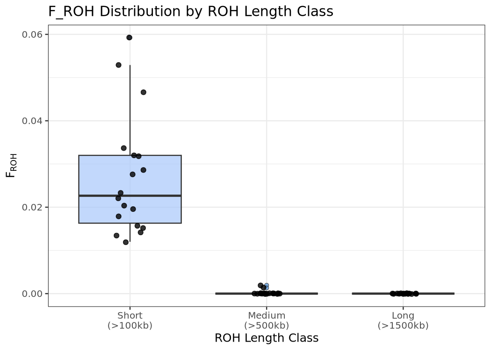
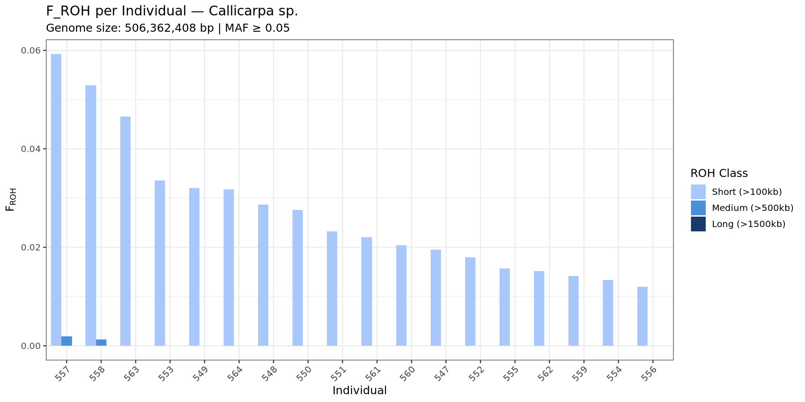

# SNP Variant Calling Pipeline for Population Genomics

pipeline for SNP discovery and variant calling from raw Illumina paired-end reads, optimized for downstream population genetic analyses with **pixy**.

## Overview

This pipeline performs end-to-end variant calling from raw FASTQ files to filtered VCF files containing both **variant and invariant sites**, which are essential for accurate population genetic statistics with pixy (https://pixy.readthedocs.io/en/latest/).

### Key Features

- **All-sites VCF generation**: Produces VCF files with both variant and invariant sites required by pixy
- **Parallel processing**: Processes multiple samples simultaneously with configurable resource allocation
- **Smart checkpoint system**: Automatically resumes from interruptions and skips completed steps
- **Storage optimization**: Automatic cleanup of intermediate files to conserve disk space
- **Quality control**: Built-in metrics collection at every step

## Pipeline Workflow

```
Raw FASTQ reads
    ↓
1. QC analysis (fastqc, fastp)
    ↓
2. Read Alignment (BWA-MEM)
    ↓
3. Duplicate Marking (GATK MarkDuplicates)
    ↓
4. Variant Calling per sample (GATK HaplotypeCaller with -ERC GVCF)
    ↓
5. Joint Genotyping (GATK GenotypeGVCFs) - ALL sites
    ↓
5. Variant Filtering
    ├─→ Filtered variant sites only (SNPs)  -> for other populations genomic analyses
    ├─→ Filtered invariant sites only
    └─→ Merged all-sites VCF (for pixy)

```

## Requirements

### Software Used

| Tool | Version | Purpose |
|------|---------|---------|
| **fastp** | 1.0.1 | Quality control and read trimming |
| **BWA-MEM** | 2.3 | Read alignment to reference genome |
| **SAMtools** | 1.23 | BAM file manipulation and indexing |
| **GATK** | 4.6.2.0 | SNP calling and filtering |
| **BCFtools** | 1.23 | VCF file manipulation |
| **VCFtools** | 0.1.17 | Population genetics filtering |
| **PLINK** | 2.0.0a.6.9 | LD pruning and format conversion |
| **Pixy** | 2.0.0.beta14 | pi diversity estimation |
| **GNU parallel** | 20190922 | parallel processing |

### Input Data

- **Paired-end FASTQ files**: Illumina sequencing reads (gzip compressed)
  - Naming convention: `{sample}_R1.fastq.gz` and `{sample}_R2.fastq.gz`
- **Reference genome**: https://doi.org/10.1093/gigascience/giaa093, FASTA format (will be indexed automatically)

## Installation

1. Clone this repository:
```bash
git clone https://github.com/yourusername/snp-variant-calling-pipeline.git
cd snp-variant-calling-pipeline
```

2. Ensure all dependencies are installed and in your PATH

3. Configure the pipeline by editing the configuration section in `snp_invariants.sh`:

```bash
# Input/Output paths
READS_DIR="/path/to/your/trimmed_reads"
REF_GENOME="/path/to/reference/genome.fa"
WORK_DIR="/path/to/output/directory"

# Computational resources
TOTAL_CORES=80
TOTAL_MEM=600  # GB
MAX_PARALLEL_SAMPLES=8
THREADS_PER_SAMPLE=10
```

## Usage

### Basic Usage

```bash
bash snp_invariants.sh
```

The pipeline will:
1. Automatically discover all FASTQ pairs in the input directory
2. Process samples in parallel
3. Generate joint-called VCF files
4. Apply quality filters
5. Produce population assignment templates for pixy

### Output Structure

```
results/
├── alignment/              # Sorted BAM files
├── markdup/                # Duplicate-marked BAM files
├── variants/
│   ├── raw/                # Raw GVCF files per sample
│   ├── all_sites/          # Joint-called all-sites VCF
│   │   ├── cohort.allsites.vcf.gz
│   │   ├── populations.txt
│   │   └── sample_list.txt
│   └── filtered/           # Filtered VCF files
│       ├── cohort.snps.final.vcf.gz
│       ├── cohort.invariant.final.vcf.gz
│       └── cohort.allsites.filtered.vcf.gz
├── metrics/                # QC statistics
└── logs_parallel/          # Detailed logs for each step
```

## Results

### QC Analaysis 
- Raw FastQC report: [raw_multiqc_report.html](qc/qc_results/raw_fastqc/raw_multiqc_report.html)
- Trimmed FastQC report (after fastp): [trimmed_multiqc_report.html](qc/qc_results/trimmed_fastqc/trimmed_multiqc_report.html)

> ⚠️   Note: GitHub does not render HTML reports. Download the file and open it locally to view the interactive MultiQC report.


|Raw Reads     | Trimmed reads|
|--------------|--------------|
|4.74 billion  | 4.73 billion |

99.71% retained

### Alignemnt to reference genome

| Sample | Mapped (%) |
|--------|------------|
| 547    | 68.82 |
| 548    | 73.30 |
| 549    | 16.65 |
| 550    | 68.66 |
| 551    | 70.73 |
| 552    | 77.13 |
| 553    | 10.71 |
| 554    | 63.19 |
| 555    | 23.35 |
| 556    | 51.35 |
| 557    | 6.02  |
| 558    | 6.90  |
| 559    | 75.34 |
| 560    | 17.26 |
| 561    | 36.01 |
| 562    | 29.70 |
| 563    | 16.51 |
| 564    | 11.39 |

Complete alignment and mark duplicate results:
[Metrics directory](snp_calling/snp_calling_pixy/results/metrics)

### Variant calling

- Total samples processed: 18 

 
|| all joined sites (variant and invariant) |  filtered variant sites (SNPs) | filtered invariant sites |
|-|-----------------------------------------|--------------------------------|--------------------------|
|File        | cohort.allsites.vcf.gz | cohort.snps.final.vcf.gz | cohort.invariant.final.vcf.gz        |
|ts/ tv      | 2.21                   | 2.62                     | 0                                    |
|SNPs        | 7,857,765              | 645,785                  | 0                                    |
|Invariants  | 211,002,973            | 0                        | 24,636,637                           |

- Hard filters

Variant sites

--QD (Quality by Depth): QD < 2.0
--FS (Fisher Strand) > 60.0
--MQ (Mapping Quality) < 40.0
--SOR (Strand Odds Ratio) > 3.0
--MQRankSum (Mapping Quality Rank Sum) < -12.5
--ReadPosRankSum (Read Position Rank Sum) < -8.0

Invariant sites

--DP (Depth of Coverage) < 20
--DP (Depth of Coverage) > 500
--MQ (Mapping Quality) < 40.0

Popfilters

Variant sites 

--remove-indels \
--hwe 0.01 \
--maf 0.01 \
--max-missing 0.8 \
--min-meanDP 20 \
--max-meanDP 500 \

## vcf files for downstream populations analysis

LD filter parameters
WINDOW_SIZE=50
LD_THRESHOLD=0.2
STEP_SIZE=10

ld_pruned_50K.snps.vcf.gz
ld_pruned_5K.snps.vcf.gz

## Individual-Level Inbreeding Analysis: Runs of Homozygosity (ROH)

ROH analysis identifies continuous stretches of homozygous genotypes in each individual's genome that arise from inheriting identical-by-descent (IBD) haplotypes from both parents. Because this dataset consists of 18 individuals rather than a population sample, classical population-level statistics (Ne estimation, bottleneck tests) are not appropriate. ROH and the derived inbreeding coefficient F_ROH are instead computed per individual, providing actionable metrics for conservation management.

> **Input file:** `cohort.snps.final.vcf.gz` — the LD-pruned full SNP set (not the 5K/50K subsets, which are too sparse for segment detection on a 506 Mb genome).

---

### Pre-processing

Before ROH calling, the pipeline applies two sequential filters to the input VCF:

```
cohort.snps.final.vcf.gz
    ↓
bcftools view --min-alleles 2 --max-alleles 2 --type snps   # biallelic SNPs only
    ↓
vcftools --max-missing 0.9 --maf {0.05 | 0.10}             # call rate + MAF (no HWE filter*)
    ↓
for_roh_dense_maf{005|010}.vcf.gz
```

> **HWE filtering is intentionally excluded.** Inbred individuals systematically violate HWE at heterozygous loci — applying an HWE filter before ROH analysis removes exactly the signal being measured.

Two MAF thresholds (0.05 and 0.10) are run in parallel to assess sensitivity. Results are compared in `froh_maf_sensitivity.csv`; if F_ROH values are consistent across thresholds, MAF 0.05 is reported as the primary result (more SNPs = better segment boundary resolution).

---

### ROH Detection — Three Length Classes

ROH length reflects the recency of the inbreeding event. Longer segments indicate more recent common ancestry because recombination has had less time to break them up. Three classes are detected independently with PLINK v1.9 `--homozyg`:

| Class | Min. length | Min. SNPs | Gap allowed | Biological interpretation |
|---|---|---|---|---|
| Short | 100 kb | 25 | 1,000 kb | Ancient / background inbreeding, many generations ago |
| Medium | 500 kb | 50 | 1,000 kb | Moderate; several generations back |
| Long | 1,500 kb | 100 | 500 kb | Recent inbreeding, 1–3 generations (parent-offspring, half-sibs) |

The gap parameter for long ROH is deliberately more stringent (500 kb vs. 1,000 kb) to prevent over-merging of genuinely distinct recent segments.

---

### F_ROH Calculation

F_ROH is the proportion of the autosomal genome covered by ROH. It is the most robust individual-level inbreeding estimator when whole-genome SNP data are available.

```
F_ROH = Σ(ROH segment lengths in bp) / autosomal genome size
      = Σ(KB × 1000) / 506,362,408
```

**Reference thresholds:**

| F_ROH | Equivalent pedigree relationship |
|---|---|
| > 0.0625 | Second-cousin mating |
| > 0.125 | First-cousin mating |
| > 0.25 | Parent-offspring or full-sibling mating |

---

### Output Structure

```
roh_analysis/
├── density_check/      # SNP density per scaffold — validates ROH parameter choices
├── maf_comparison/     # Filtered VCFs (MAF 0.05 and 0.10) + PLINK binary files
├── roh_short/          # PLINK .hom / .hom.indiv — ROH > 100 kb (ancient inbreeding)
├── roh_medium/         # PLINK .hom / .hom.indiv — ROH > 500 kb (moderate inbreeding)
├── roh_long/           # PLINK .hom / .hom.indiv — ROH > 1,500 kb (recent inbreeding)
└── froh_results/
    ├── froh_per_individual_summary.csv  # Primary result: F_ROH per individual × class
    ├── froh_maf_sensitivity.csv         # MAF 0.05 vs 0.10 delta per individual
    └── froh_distribution_by_class.pdf   # See below
```

**Primary result — F_ROH distribution by ROH length class:**



> Each boxplot shows F_ROH across all 18 individuals for one ROH length class. A collection with only the short class elevated indicates ancient bottleneck history with no recent close-relative mating. Elevation in the medium or long classes signals ongoing or recent inbreeding and identifies individuals requiring priority attention in the breeding programme.




---

### Interpreting Results

**`froh_per_individual_summary.csv`** is the primary conservation output. Each row is one individual; columns give F_ROH separately for short, medium, and long ROH classes. The cross-class pattern is more informative than any single value:

| Pattern | Interpretation | Conservation implication |
|---|---|---|
| High F_ROH (short only) | Ancient inbreeding; no recent close-relative mating | Moderate concern; historical bottleneck |
| High F_ROH (short + medium) | Sustained inbreeding over many generations | High concern |
| High F_ROH (all three classes) | Recent severe inbreeding | Critical; individual carries long IBD blocks |
| Low F_ROH (all classes) | Relatively outbred | Priority candidate for managed breeding |

**`froh_maf_sensitivity.csv`** — if `delta_FROH` is near zero for all individuals, the MAF threshold does not affect conclusions. Large deltas for specific individuals indicate that rare variants contribute meaningfully to their ROH signal; for those individuals, MAF 0.05 is the more sensitive and appropriate estimate.

**`.hom` segment files** — beyond summary statistics, the per-segment files allow detection of shared ROH regions across individuals. Two individuals with overlapping ROH on the same chromosome are likely to share a recent common ancestor in that genomic region. This complements the pairwise kinship analysis (computed from `ld_pruned_5K.snps.vcf.gz`) by providing genomic-location context for relatedness.

---

### Software

| Tool | Version | Purpose |
|---|---|---|
| **BCFtools** | 1.23 | Biallelic SNP extraction |
| **VCFtools** | 0.1.17 | MAF and call-rate filtering |
| **PLINK** | 1.9 | `--homozyg` ROH detection |
| **PLINK2** | 2.0.0a.6.9 | VCF → BED format conversion |
| **R** | — | F_ROH calculation and visualisation |
