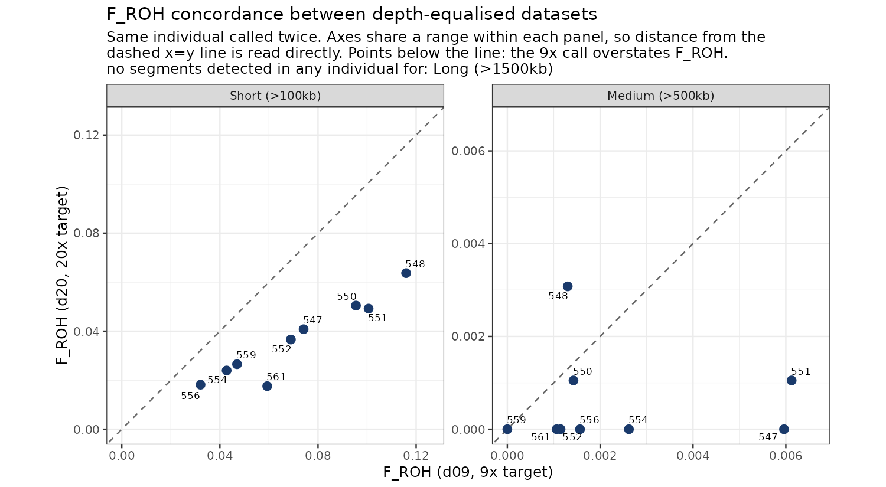
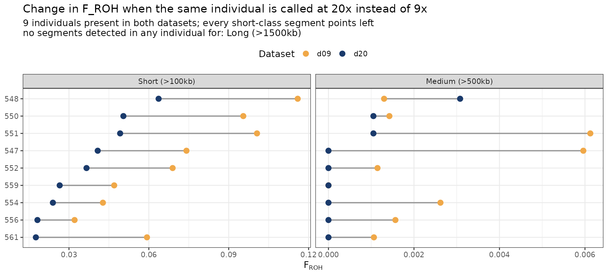
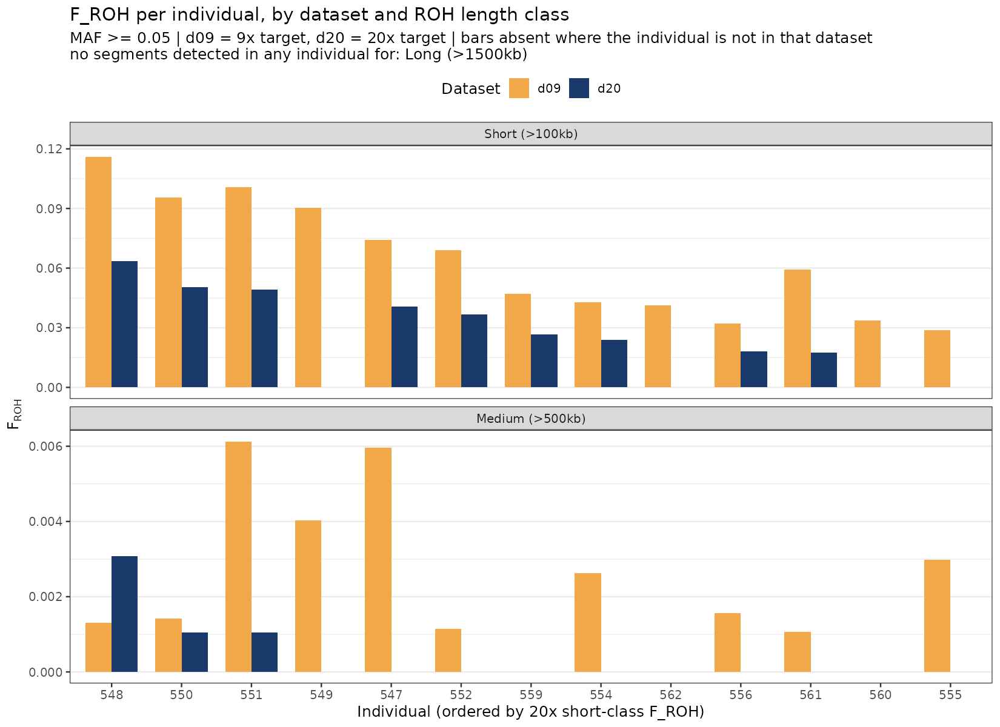

# Depth-Equalised SNP Calling for *Callicarpa americana* Population Genomics

Pipeline for SNP discovery from raw Illumina paired-end reads, producing **two
depth-equalised datasets** (9× and 20×) suitable for population genetic and
individual-level inbreeding analyses.

## Why two datasets

The first pass at this cohort produced SNP calls that were confounded by
coverage. Raw sequencing yield was uniform across the 18 libraries (52–98×
expected), but **usable** depth after alignment spanned nearly 25-fold
(2.8–67.7×). The cause is not sequencing depth and not duplication — it is
mapping rate, which ranges from 5.9% to 76.8%.

Because GATK's confidence in a genotype scales with read depth, a cohort with a
25-fold depth spread yields site- and genotype-level missingness that tracks
sample identity. Any downstream statistic sensitive to missingness — π, F_ST,
kinship, F_ROH — inherits that bias.

Two things are done about it:

1. **Samples below a depth floor are excluded.** Downsampling can remove reads
   but cannot create them, so a sample below the target can never join that
   dataset.
2. **Every retained sample is downsampled to a common target depth**, so the
   cohort is uniform by construction rather than by hope.

This is applied twice, at 9× and at 20×, giving a shallow/wide dataset (13
samples) and a deep/narrow one (9 samples). Neither is "the" answer: results
that hold in both are robust to the depth–sample-size trade-off, and results
that appear in only one should be treated with suspicion.

> Full methodological detail, in prose suitable for a manuscript, is in
> [`methods.txt`](methods.txt).

---

## Pipeline Workflow

```
Raw FASTQ (18 samples)
    ↓
1. QC + trimming (FastQC, fastp) ──→ contamination screen (Kraken2, seqkit GC)
    ↓
2. Alignment (BWA-MEM) → sort → MarkDuplicates
    ↓
3. Usable-depth measurement (samtools stats)
    ↓
4. Sample assignment ──┬──→ depth ≥ 9×   (13 samples)
                       └──→ depth ≥ 20×  (9 samples)
    ↓
5. Downsample each sample to the dataset target (samtools view --subsample)
    ↓
6. Per-sample calling (HaplotypeCaller -ERC GVCF) → CombineGVCFs → GenotypeGVCFs
    ↓
7. Filtering (GATK hard filters → VCFtools population filters, depth-scaled)
    ↓
8. Downstream sets, per dataset
   ├─→ cohort.snps.final.vcf.gz      full filtered SNP set
   ├─→ ld_pruned.snps.vcf.gz         LD-pruned panel
   ├─→ ld_pruned_50K / _5K           random subsets of the pruned panel
   └─→ for_roh_dense_maf005 / 010    ROH inputs (+ PLINK .bed/.bim/.fam)
```

---

## Requirements

### Software

Versions below are the binaries **as actually invoked** by the pipeline, under
its documented activation sequence (`conda activate SNP_call`, with
`popgen_tools` prepended to `PATH` for PLINK/VCFtools).

| Tool | Version | Purpose |
|------|---------|---------|
| **FastQC** | 0.12.1 | Per-file read quality metrics |
| **MultiQC** | 1.33 | Aggregated QC reports |
| **fastp** | 1.0.1 | Adapter/quality trimming |
| **Kraken2** | 2.17.1 | Taxonomic contamination screening |
| **seqkit** | 2.3.0 | GC-distribution screen, read subsampling |
| **BWA** | 0.7.17-r1188 | Read alignment (`bwa mem`) |
| **SAMtools** | 1.19.2 | BAM sort/index/stats, depth measurement, downsampling |
| **GATK** | 4.6.2.0 | MarkDuplicates, HaplotypeCaller, joint genotyping, hard filters |
| **BCFtools** | 1.19 | VCF manipulation and stats |
| **VCFtools** | 0.1.16 | Population-level filtering |
| **PLINK** | 1.90b6.21 | LD pruning; `--homozyg` ROH detection |
| **PLINK 2** | 2.0.0-a.6.9 | VCF → BED conversion for ROH |
| **GNU parallel** | 20231122 | Job-level parallelism |

> The reference directory carries both a BWA and a BWA-MEM2 index, but only BWA
> 0.7.17 is installed; alignment used `bwa mem`.

### Input data

- **Paired-end FASTQ**, gzip compressed, named `{sample}_R1.fastq.gz` /
  `{sample}_R2.fastq.gz`
- **Reference genome**: <https://doi.org/10.1093/gigascience/giaa093>
  (506,362,408 bp; indexed automatically if needed)
- **Kraken2 index**: PlusPFP capped 16 GB (`k2_pluspfp_16_GB_20260626`). The
  standard index is **not** usable here — it contains no plants or fungi.

---

## Usage

### 1. Quality control and contamination screen

```bash
conda activate qc_illumina
cd qc
bash run_me.sh            # = KRAKEN_DB=... bash qc_pipeline_v2.sh ../raw/ qc_results/ 200
```

Re-running is safe: completed samples are detected and skipped. The Kraken2 DB
path defaults to the project index; set `KRAKEN_DB=` (empty) to disable the
taxonomic screen.

### 2. SNP calling and dataset construction

```bash
conda activate SNP_call
cd snp_calling
bash snp_datasets.sh [phase]     # phase = all | align | assign | call | downstream
```

### 3. Monitoring

```bash
bash snp_calling/monitor_datasets.sh -w        # watch mode, refreshes every 30 s
```

Read-only; safe to run against a live pipeline.

### Storage behaviour

Intermediates are deleted as soon as they are consumed. Sorted BAMs are removed
after duplicate marking, downsampled BAMs after GVCF creation, and the combined
GVCF after joint genotyping (`KEEP_SORTED_BAM`, `KEEP_MARKDUP_BAM`,
`KEEP_DOWNSAMPLED_BAM`, `KEEP_COMBINED_GVCF` all default to `false`). The full
run peaked below half of the available filesystem.

---

## Methods

### Read QC and trimming

`fastp` with a 14 bp 5′ hard trim on both mates, adapter auto-detection,
overlap-based base correction, poly-G/poly-X trimming, and a low-complexity
filter:

```
-f 14 -F 14 --detect_adapter_for_pe --qualified_quality_phred 20
--unqualified_percent_limit 30 --length_required 50 --trim_poly_g --trim_poly_x
--low_complexity_filter --complexity_threshold 30 --correction
--overlap_len_require 30 --overlap_diff_limit 5
```

### Contamination screening

200,000 read pairs per sample are classified against the PlusPFP index. The
**absolute classified fraction is not the contamination metric** — *C.
americana* is absent from RefSeq, so 91–96% of reads are unclassified even in
clean samples. What separates samples is the *composition* of the classified
fraction: on-target reads land on related Lamiales genera (*Sesamum*, *Salvia*,
*Primulina*, *Olea*, *Henckelia*) and score as Viridiplantae, while the
contaminant is soil/rhizosphere bacteria.

The reported index is therefore the **plant:bacteria ratio**.

### Alignment, duplicate marking, and depth measurement

`bwa mem` → coordinate sort → GATK `MarkDuplicates`. Usable depth is then

```
usable_depth = bases mapped (cigar) / 506,362,408
```

from `samtools stats -F 0xD04`, which excludes duplicates (0x400), secondary
(0x100), supplementary (0x800), and unmapped (0x4) reads. None of those classes
contributes independent evidence to a genotype call, so none should count
toward depth. Using `bases mapped (cigar)` rather than raw read length means
soft-clipped ends do not inflate the estimate.

### Sample exclusion

A sample enters a dataset **iff its measured usable depth ≥ the dataset
target**. That is the only criterion. The contamination screen explains *why* a
sample fails, but is never itself grounds for removal.

### Depth equalisation

Each retained sample is downsampled to the common target:

```
f_i = min(1, T / d_i)
samtools view -b --subsample f_i --subsample-seed 42
```

`--subsample` hashes read *names*, so mates are retained or discarded together
and pairing is preserved. The seed is fixed at 42 for reproducibility.

### Variant calling and joint genotyping

`HaplotypeCaller -ERC GVCF` per sample (`--min-base-quality-score 20`), then
`CombineGVCFs` → `GenotypeGVCFs`, independently per dataset. Note that a sample
in both datasets is called **twice**, from two different downsampled BAMs — the
datasets are not nested subsets of one call set.

### Filtering

GATK hard filters (`VariantFiltration`):

```
QD < 2.0 | FS > 60.0 | MQ < 40.0 | SOR > 3.0
MQRankSum < -12.5 | ReadPosRankSum < -8.0
```

Then VCFtools population filters:

```
--remove-indels --hwe 0.01 --maf 0.01 --max-missing 0.8
--min-meanDP <scaled> --max-meanDP <scaled>
```

**The depth bounds scale with the dataset target** and are not constants:

| Dataset | Target | `--min-meanDP` | `--max-meanDP` |
|---|---|---|---|
| `d09` | 9× | 4 | 27 |
| `d20` | 20× | 10 | 60 |

> ⚠️ This corrects a real error in the previous configuration. The fixed
> `--min-meanDP 20` inherited from the earlier pipeline would have removed
> **every site** in the 9× dataset, whose mean depth is 9 by construction.

### LD pruning and marker subsets

PLINK 1.9 `--indep-pairwise 50 10 0.2`, then random draws of 50,000 and 5,000
SNPs from the pruned panel (fixed seed, header preserved, re-sorted so the
output stays tabix-indexable).

### ROH input preparation

Built from the **full** filtered SNP set, not the pruned panel — pruning removes
exactly the correlated markers that ROH detection needs to trace contiguous
homozygous tracts, and the 5K/50K subsets are far too sparse for segment
boundaries on a 506 Mb genome.

```
cohort.snps.final.vcf.gz
    ↓ bcftools view --min-alleles 2 --max-alleles 2 --type snps
    ↓ vcftools --max-missing 0.9 --maf {0.05 | 0.10}      (no HWE filter)
for_roh_dense_maf{005|010}.vcf.gz  →  PLINK .bed/.bim/.fam
```

> **HWE filtering is intentionally excluded.** Inbred individuals systematically
> violate HWE at heterozygous loci — an HWE filter before ROH analysis removes
> exactly the signal being measured.

---

## Results

### Read QC

| | Reads | Bases |
|---|---|---|
| Raw | 4.74 billion | 711.2 Gb |
| Trimmed | 4.72 billion | 641.0 Gb |
| Retained | 99.6% | **90.1%** |

Base retention is the meaningful figure: the 14 bp 5′ hard trim accounts for
most of the ~10% loss. Q30 rates are 87.1–93.3% across all samples.

- [raw_multiqc_report.html](qc/qc_results/reports/raw_multiqc_report.html)
- [trimmed_multiqc_report.html](qc/qc_results/reports/trimmed_multiqc_report.html)
- [yield_per_sample.csv](qc/qc_results/reports/yield_per_sample.csv)

> ⚠️ GitHub does not render HTML reports. Download and open locally.

### Contamination screen

Classified composition from 200k read pairs per sample
([contamination_index.tsv](qc/qc_results/contamination_screen/contamination_index.tsv)):

| Sample | Plant % | Bacteria % | Unclassified % | Plant:Bacteria |
|---|---|---|---|---|
| 548 | 3.75 | 0.42 | 95.39 | **8.93** |
| 559 | 4.91 | 1.03 | 93.62 | 4.77 |
| 550 | 6.09 | 1.33 | 92.19 | 4.58 |
| 551 | 6.80 | 1.49 | 91.32 | 4.56 |
| 547 | 6.80 | 1.54 | 91.35 | 4.42 |
| 552 | 6.80 | 1.62 | 91.10 | 4.20 |
| 554 | 4.54 | 1.52 | 93.63 | 2.99 |
| 561 | 3.23 | 2.29 | 93.87 | 1.41 |
| 556 | 3.76 | 3.51 | 92.46 | 1.07 |
| 549 | 2.13 | 3.10 | 94.48 | 0.69 |
| 562 | 2.00 | 3.14 | 94.56 | 0.64 |
| 560 | 1.72 | 3.49 | 94.45 | 0.49 |
| 555 | 1.47 | 4.35 | 93.92 | 0.34 |
| 553 | 0.88 | 2.94 | 95.18 | 0.30 |
| 563 | 1.44 | 4.85 | 93.37 | 0.30 |
| 564 | 0.87 | 3.17 | 95.68 | 0.27 |
| 558 | 0.76 | 6.59 | 92.38 | 0.12 |
| 557 | 0.66 | 5.84 | 93.12 | **0.11** |

**The plant:bacteria ratio predicts mapping rate before any alignment is run:**
Pearson *r* = **0.962** between log₁₀(plant:bacteria) and primary mapping rate
(*n* = 18).

The contaminant profile — Actinomycetes (*Mycobacterium*, *Mycolicibacterium*,
*Streptomyces*, *Nocardioides*, *Pseudonocardia*), *Bradyrhizobium*,
*Sphingomonas*, *Methylobacterium*, plus fungal *Colletotrichum* — is
soil/rhizosphere in character. This points to carryover at collection or a high
epi-endophytic load, **not** to a library-prep or index-hopping problem.
Practically: re-sequencing the same libraries deeper will not rescue samples
557, 558, or 553.

### Alignment, depth, and dataset membership

| Sample | Mapped % | Duplicate % | Usable depth | `d09` | `d20` |
|---|---|---|---|---|---|
| 547 | 68.82 | 2.38 | 41.71 | ✅ | ✅ |
| 548 | 73.30 | 2.24 | 35.27 | ✅ | ✅ |
| 549 | 16.65 | 2.15 | 11.13 | ✅ | — |
| 550 | 68.66 | 2.99 | 42.57 | ✅ | ✅ |
| 551 | 70.73 | 2.37 | 35.52 | ✅ | ✅ |
| 552 | 77.13 | 3.68 | 47.91 | ✅ | ✅ |
| 553 | 10.71 | 2.73 | 3.88 | — | — |
| 554 | 63.19 | 2.64 | 50.19 | ✅ | ✅ |
| 555 | 23.35 | 1.40 | 11.21 | ✅ | — |
| 556 | 51.35 | 1.83 | 26.25 | ✅ | ✅ |
| 557 | 6.02 | 2.05 | 2.80 | — | — |
| 558 | 6.90 | 1.50 | 3.27 | — | — |
| 559 | 75.34 | 2.96 | 67.72 | ✅ | ✅ |
| 560 | 17.26 | 2.06 | 11.86 | ✅ | — |
| 561 | 36.01 | 2.41 | 25.09 | ✅ | ✅ |
| 562 | 29.70 | 1.86 | 19.63 | ✅ | — |
| 563 | 16.51 | 1.51 | 7.68 | — | — |
| 564 | 11.39 | 2.04 | 6.58 | — | — |

**Duplicate rates are uniformly low (1.4–3.7%) and uncorrelated with usable
depth** — duplication is not the driver. Mapping rate is.

Five samples fail the 9× floor (553, 557, 558, 563, 564); nine more fall below
20×. Sample 562 (19.63×) misses the 20× target narrowly.

Full metrics: [`snp_calling/results/metrics/`](snp_calling/results/metrics)
([`depth_summary.tsv`](snp_calling/results/metrics/depth_summary.tsv))

### Depth equalisation — verification

Mean genotype depth at called sites, measured on the delivered VCFs:

| Dataset | Native depth range | Spread | Post-equalisation range | Spread |
|---|---|---|---|---|
| `d09` (13 samples) | 11.13 – 67.72× | 6.08-fold | 10.10 – 13.23 | **1.31-fold** |
| `d20` (9 samples) | 25.09 – 67.72× | 2.70-fold | 24.22 – 29.70 | **1.23-fold** |

The residual spread is ~1.3-fold rather than exactly 1.0 because equalisation
targets *genome-wide* depth while the table reports depth *at called sites*,
which is biased upward — variant sites sit in callable, non-repetitive regions,
whereas zero-coverage regions drag the genome-wide mean down without
contributing any sites. The bias is a property of where variants are, not of
the equalisation.

The cost is real and worth stating plainly: sample 559 contributes only ~13% of
its reads to `d09` and ~30% to `d20`.

### SNP counts

| Output | `d09` (13 samples) | `d20` (9 samples) |
|---|---|---|
| `cohort.snps.final.vcf.gz` | 1,952,554 | 2,004,660 |
| `ld_pruned.snps.vcf.gz` | 160,242 | 119,111 |
| `ld_pruned_50K.snps.vcf.gz` | 50,000 | 50,000 |
| `ld_pruned_5K.snps.vcf.gz` | 5,000 | 5,000 |
| `for_roh_dense_maf005.vcf.gz` | 1,312,594 | 1,789,614 |
| `for_roh_dense_maf010.vcf.gz` | 1,081,262 | 1,515,367 |

Two patterns are worth noting. The final SNP counts are nearly identical
(1.95 M vs 2.00 M) despite `d20` having four fewer samples — deeper, cleaner
genotypes offset the reduced sample count. But the ROH inputs diverge sharply
(1.31 M vs 1.79 M): those apply `--max-missing 0.9`, and the shallower `d09`
loses substantially more sites to that stricter call-rate threshold.

`d09` also retains more SNPs after LD pruning (160 K vs 119 K), as expected —
more samples means more independent haplotypes and slower LD decay across the
window.

### Output structure

```
snp_calling/results/
├── metrics/                       # flagstat, duplicate metrics, depth_summary.tsv
│                                  # samples_d09.txt, samples_d20.txt
├── d09/                           # ── 9× dataset, 13 samples ──
│   ├── gvcf/                      # per-sample GVCFs (retained)
│   ├── raw/cohort.raw.vcf.gz
│   ├── filtered/
│   │   ├── cohort.snps.pass.vcf.gz
│   │   └── cohort.snps.final.vcf.gz
│   ├── downstream/
│   │   ├── ld_pruned.snps.vcf.gz
│   │   ├── ld_pruned_50K.snps.vcf.gz
│   │   └── ld_pruned_5K.snps.vcf.gz
│   └── roh/
│       ├── for_roh_dense_maf005.vcf.gz  + callicarpa_maf005.{bed,bim,fam}
│       └── for_roh_dense_maf010.vcf.gz  + callicarpa_maf010.{bed,bim,fam}
└── d20/                           # ── 20× dataset, 9 samples — same layout ──
```

Sorted, duplicate-marked, and downsampled BAMs are removed on completion by
design.

---

## Individual-Level Inbreeding Analysis: Runs of Homozygosity (ROH)

> **Status:** run on both datasets. `roh_claude.sh` now consumes the PLINK
> binaries prepared by `snp_datasets.sh` Phase 4 and no longer repeats the
> filtering itself. Outputs are in `results/{d09,d20}/roh_analysis/` plus a
> cross-dataset comparison in `results/roh_comparison/`.

```bash
bash roh_claude.sh          # both datasets + cross comparison
bash roh_claude.sh d20      # one dataset
FORCE=1 bash roh_claude.sh  # recompute existing outputs
```

ROH identifies continuous stretches of homozygous genotypes arising from
inheriting identical-by-descent haplotypes from both parents. Because this
dataset is a set of individuals rather than a population sample, classical
population-level statistics (Ne estimation, bottleneck tests) are not
appropriate. ROH and the derived inbreeding coefficient F_ROH are computed per
individual instead, giving actionable conservation metrics.

Two MAF thresholds (0.05 and 0.10) are run in parallel to assess sensitivity. If
F_ROH is consistent across thresholds, MAF 0.05 is reported as primary (more
SNPs = better segment boundary resolution).

### ROH detection — three length classes

Segment length reflects how recent the inbreeding event was: longer segments
mean more recent common ancestry, because recombination has had less time to
break them up. Three classes are detected independently with PLINK 1.9
`--homozyg`:

| Class | Min. length | Min. SNPs | Gap allowed | Interpretation |
|---|---|---|---|---|
| Short | 100 kb | 25 | 1,000 kb | Ancient / background inbreeding |
| Medium | 500 kb | 50 | 1,000 kb | Moderate; several generations back |
| Long | 1,500 kb | 100 | 500 kb | Recent, 1–3 generations |

The gap parameter for long ROH is deliberately stricter (500 kb vs 1,000 kb) to
prevent over-merging of genuinely distinct recent segments.

### F_ROH calculation

```
F_ROH = Σ(ROH segment lengths in bp) / autosomal genome size
      = Σ(KB × 1000) / 506,362,408
```

| F_ROH | Equivalent pedigree relationship |
|---|---|
| > 0.0625 | Second-cousin mating |
| > 0.125 | First-cousin mating |
| > 0.25 | Parent-offspring or full-sibling mating |

### Interpreting results

`froh_per_individual_summary.csv` is the primary conservation output — one row
per individual, F_ROH given separately per length class. The cross-class pattern
is more informative than any single value:

| Pattern | Interpretation | Conservation implication |
|---|---|---|
| High F_ROH (short only) | Ancient inbreeding; no recent close-relative mating | Moderate concern; historical bottleneck |
| High F_ROH (short + medium) | Sustained inbreeding over many generations | High concern |
| High F_ROH (all three classes) | Recent severe inbreeding | Critical; long IBD blocks |
| Low F_ROH (all classes) | Relatively outbred | Priority for managed breeding |

`froh_maf_sensitivity.csv` — `delta_FROH` near zero for all individuals means
the MAF threshold does not affect conclusions. Large deltas indicate that rare
variants contribute meaningfully to that individual's ROH signal.

`.hom` segment files allow detection of ROH shared across individuals: two
individuals with overlapping ROH on the same scaffold likely share a recent
common ancestor in that region. This complements pairwise kinship (computed from
`ld_pruned_5K.snps.vcf.gz`) with genomic-location context.

### ROH results

No **long** ROH (>1,500 kb) was detected in any individual in either dataset,
and medium-class F_ROH is negligible (mean 0.0024 in `d09`, 0.0006 in `d20`;
every individual is far below the 0.0625 second-cousin threshold). **There is no
evidence of recent close-relative mating in this cohort.** The signal is
confined to the short class, i.e. ancient/background inbreeding.

#### ⚠️ Short-class F_ROH is depth-dependent — report absolute values from `d20` only

The cross-dataset comparison exists to catch exactly this, and it did:

| Class | mean F_ROH `d09` | mean F_ROH `d20` | Ratio | Individuals shifting down | *r* |
|---|---|---|---|---|---|
| Short | 0.0707 | 0.0363 | **1.95×** | **9 / 9** | 0.948 |
| Medium | 0.0024 | 0.0006 | 4.09× | 7 / 9 | −0.015 |
| Long | 0 | 0 | — | 0 / 9 | — |

The nine individuals present in both datasets were called twice, from
independently downsampled BAMs. Short-class F_ROH is **1.95× higher at 9× than
at 20×, and every one of the nine moves in the same direction** (sign test
*p* ≈ 0.004). This is the expected signature of allelic dropout: at 9×, true
heterozygotes are more often called homozygous, so tracts that should be broken
by a heterozygous site are read as continuous.

Two consequences:

- **Absolute F_ROH and pedigree-threshold comparisons must come from `d20`.**
  Quoting `d09` short-class values would overstate inbreeding roughly two-fold.
- **Relative ranking is largely preserved** (Spearman ρ = 0.883): eight of the
  nine individuals rank within one position of each other across datasets, and
  both agree on the three most inbred (548, 550, 551). `d09` therefore remains
  usable for *prioritising* individuals, where its larger sample size helps.
  The exception is **561**, which ranks 6th of 9 in `d09` but last in `d20` —
  treat its `d09` value with caution.

The medium class shows no meaningful cross-dataset correlation (*r* ≈ 0), but
the values are so close to zero that this is noise around a floor rather than
disagreement.



> **Reading this plot:** both axes share a range *within* each panel and the
> panels are square, so distance from the dashed x=y line can be read directly.
> Every individual sits well below the line — the agreement is in *ordering*,
> not in value. A high correlation coefficient (*r* = 0.948 for the short class)
> is compatible with a large systematic offset, which is exactly the situation
> here, and is why the correlation alone would have been misleading.

The same shift as a paired plot, which makes the direction unmistakable:



The long class is omitted from both figures because no segments were detected in
any individual — an empty panel with an auto-scaled axis reads like missing
data rather than a measured absence.

Outputs: [`results/roh_comparison/`](snp_calling/results/roh_comparison) —
`froh_all_datasets.csv` (all F_ROH values, long form),
`froh_dataset_concordance.csv` (paired, one row per individual × class), and
three figures as both `.png` and `.pdf`.

#### Per-individual F_ROH (short class, MAF ≥ 0.05)

Sorted by the `d20` value where available. **`d20` is the reportable column**;
`d09` is shown for the four individuals that only reach the 9× floor, and for
ranking.

| Sample | F_ROH `d20` | Segments `d20` | F_ROH `d09` | Segments `d09` |
|---|---|---|---|---|
| 548 | **0.0637** | 198 | 0.1159 | 369 |
| 550 | 0.0504 | 173 | 0.0955 | 295 |
| 551 | 0.0492 | 166 | 0.1006 | 311 |
| 547 | 0.0408 | 144 | 0.0741 | 227 |
| 552 | 0.0366 | 133 | 0.0689 | 230 |
| 559 | 0.0265 | 94 | 0.0470 | 162 |
| 554 | 0.0240 | 73 | 0.0427 | 141 |
| 556 | 0.0182 | 62 | 0.0321 | 96 |
| 561 | 0.0176 | 68 | 0.0593 | 200 |
| 549 | — | — | 0.0903 | 285 |
| 562 | — | — | 0.0413 | 131 |
| 560 | — | — | 0.0335 | 119 |
| 555 | — | — | 0.0288 | 94 |

**No individual reaches the 0.0625 second-cousin threshold on `d20`** — 548 is
closest at 0.0637 in the short class, which reflects background rather than
recent inbreeding, since its long-class F_ROH is zero. Only 548, 550 and 551
carry any medium-class ROH at all in `d20` (one to two segments each).

Sample 549 would rank second-highest on `d09` (0.0903) but is absent from `d20`
at 11.13× usable depth, so it has no depth-stable estimate. Given that `d09`
inflates this statistic ~2×, its true value is likely nearer 0.045 — but that is
an inference from the cohort-wide ratio, not a measurement.

The same data as a figure — every individual, both datasets, both non-empty
length classes:



Individuals are ordered by their 20× short-class value; a missing bar means the
individual is not in that dataset (four samples clear only the 9× floor). The
short panel shows the depth offset directly: the orange 9× bar exceeds the navy
20× bar for every one of the nine shared individuals. The medium panel shows how
sparse that signal is — most individuals have no medium-class segment at all,
and 548 is the only one where the 20× value exceeds the 9× value.

Per-dataset outputs: `results/{d09,d20}/roh_analysis/froh_results/`
(`froh_per_individual_summary.csv`, `froh_all_classes.csv`,
`froh_maf_sensitivity.csv`, plus three figures each as `.png` and `.pdf`).

---

### Why the previous ROH results changed

An earlier version of this analysis (all 18 samples, no depth equalisation,
archived under `results/variants/filtered/roh_analysis/`) reported substantially
more inbreeding and a different ranking of individuals. That result should not
be used. This section records why, because it is the first thing a reviewer or
co-author will ask.

#### The old ranking tracked sequencing depth, not inbreeding

The five individuals the old analysis flagged as most inbred:

| Rank | Sample | Old F_ROH (short) | Usable depth | Plant:bacteria | Passes 9× floor? |
|---|---|---|---|---|---|
| 1 | 557 | 0.1349 | **2.80×** | **0.11** | ✗ |
| 2 | 558 | 0.1276 | **3.27×** | **0.12** | ✗ |
| 3 | 563 | 0.0994 | 7.68× | 0.30 | ✗ |
| 4 | 549 | 0.0807 | 11.13× | 0.69 | ✓ |
| 5 | 548 | 0.0755 | 35.27× | 8.93 | ✓ |

The top two were the two most contaminated libraries in the cohort. Across all
18 samples:

- Old F_ROH vs usable depth: **Spearman ρ = −0.651** — shallower samples looked
  more inbred.
- Samples failing the 9× floor averaged **2.07×** the F_ROH of those passing
  (0.1015 vs 0.0491).
- The deepest sample (559, 67.7×) ranked near the *bottom* of the old list.

#### Mechanism: allelic dropout

At 3× coverage a true heterozygote is often covered by only two or three reads,
and there is a substantial chance all of them carry the same allele — so the
site is called homozygous. Stretches of genome then appear homozygous when they
are not, and PLINK joins them into apparent ROH.

**Less data produces more apparent inbreeding.** F_ROH is therefore not
comparable across samples of unequal depth, which is precisely what the old
cohort was.

#### It was not purely artefactual

Among the nine samples that did have adequate depth, the old and new rankings
agree at **Spearman ρ = +0.800**, and 548 is top in both. Real signal was
present — but it was overlaid by a depth gradient that dominated the *top* of
the ranking, which is exactly where conservation decisions are made. Even for
those nine, old values were inflated by a mean factor of **1.48×**.

#### The signal we get instead

The depth-equalised analysis answers a different, better-posed question, and the
answer is a genuine negative rather than an absence of result:

| Finding | Evidence |
|---|---|
| **No recent close-relative mating** | Zero long ROH (>1,500 kb) in any individual, in either dataset |
| **No individual above the second-cousin threshold** | Max F_ROH on `d20` is 0.0637 (548); threshold is 0.0625, and 548's long-class F_ROH is zero |
| **Homozygosity is ancient/background** | Signal confined to the short class; only 548, 550, 551 carry any medium-class segment (1–2 each) |

The negative is real, not a detection failure. The reference is chromosome-scale
(N50 29.05 Mb, longest 39.43 Mb, 18 scaffolds ≥ 1.5 Mb), and in the `d20` ROH
input the 17 chromosome-scale scaffolds carry **99.6% of the SNPs**
(1,782,997 of 1,789,614) at a mean spacing of **0.28 kb**. A 1,500 kb segment
would therefore be covered by several thousand markers, far above the
`--homozyg-snp 100` requirement. Long ROH would be detected if it existed.

**Conservation reading:** the collection shows historical/background
homozygosity but no evidence of inbreeding arising within the breeding
programme. No emergency pairing intervention is indicated. The old result would
have prioritised 557 and 558 for urgent management; they are not inbred, their
libraries are contaminated.

#### What remains genuinely unknown

Six samples — 553, 557, 558, 563, 564 and 549 — have no depth-stable estimate.
That is **unknown, not fine**. Because the contamination is soil/rhizosphere in
origin rather than a library-prep failure, sequencing the same libraries deeper
will not resolve them; they need fresh tissue.

---

## Legacy: all-sites VCFs for pixy

The earlier pipeline produced all-sites VCFs (variant + invariant) for π
estimation with [pixy](https://pixy.readthedocs.io/). The current pipeline does
**not** — it emits variant sites only. Those scripts and their outputs are
preserved under [`snp_calling/old/`](snp_calling/old) and
`snp_calling/results/variants/`, and were produced from the non-equalised call
set. If π estimation is needed on the equalised datasets, the all-sites path has
to be re-added to `snp_datasets.sh`; its results are subject to the same
coverage bias described at the top of this document.

---

## Open items

- Short-class F_ROH is depth-dependent (see above). Consider whether a
  genotype-level depth floor (e.g. `--minDP`) would stabilise it further, and
  whether a 30× dataset is worth building to confirm the trend has plateaued by
  20×.
- The 14 bp 5′ hard trim is inherited from an earlier configuration and should
  be re-justified against the current raw FastQC report.
- Decide whether 553, 557, 558, 563 and 564 are reported as excluded or
  re-collected. The contamination screen indicates deeper sequencing of the
  *same* libraries will not help.
